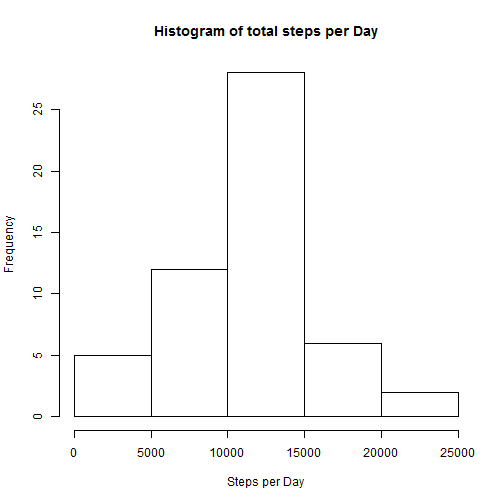
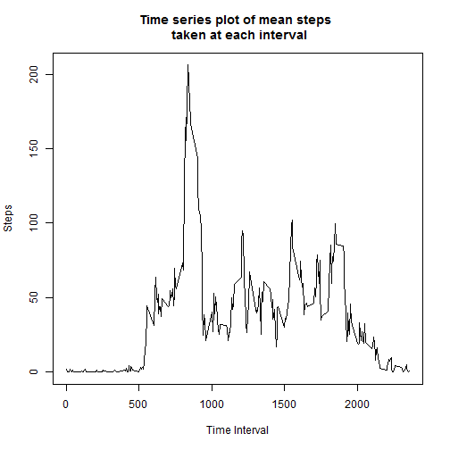
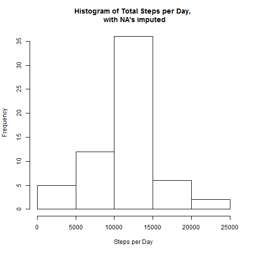
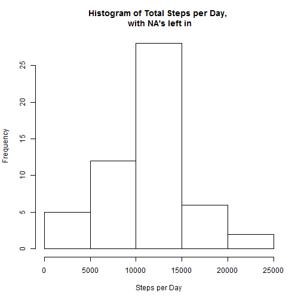
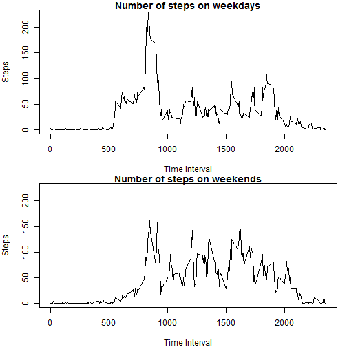

##Loading and preprocessing the data
First of all, download and load the .csv file into R

```r
setwd("C:/Users/Jacky/Desktop/Coursera/5. Reproducible Research/Course Project 1/")
data<-read.csv("activity.csv")
library(dplyr)
```

```
## 
## Attaching package: 'dplyr'
## 
## The following objects are masked from 'package:stats':
## 
##     filter, lag
## 
## The following objects are masked from 'package:base':
## 
##     intersect, setdiff, setequal, union
```

##What is mean total number of steps taken per day?

```r
group.date<-group_by(data,date)
total.steps<-summarize(group.date,sum(steps))
colnames(total.steps)<-c("date","steps")
hist(as.numeric(total.steps$steps),xlab="Steps per Day",main="Histogram of total steps per Day")
```

 

```r
print(paste0("Mean: ",mean(total.steps$steps,na.rm=TRUE)))
```

```
## [1] "Mean: 10766.1886792453"
```

```r
print(paste0("Median: ",median(total.steps$steps,na.rm=TRUE)))
```

```
## [1] "Median: 10765"
```

##What is the average daily activity pattern?

```r
group.interval<-group_by(data,interval)
mean.interval.steps<-summarize(group.interval,mean(steps,na.rm=T))
colnames(mean.interval.steps)<-c("interval","steps")
plot.ts(x=mean.interval.steps$interval,y=mean.interval.steps$steps,xlab="Time Interval",ylab="Steps",main="Time series plot of mean steps \n taken at each interval",type="n")
lines(x=mean.interval.steps$interval,y=mean.interval.steps$steps)
```

 

```r
max.step<-mean.interval.steps[which.max(mean.interval.steps$steps),]
print(paste0("The most average number of steps in an interval is: ", round(max.step[1,2],2)))
```

```
## [1] "The most average number of steps in an interval is: 206.17"
```

```r
print(paste0("The interval with the most number of steps: ", max.step[1,1]))
```

```
## [1] "The interval with the most number of steps: 835"
```

##Imputting missing values

Filled in NA's with average number of steps at each interval from previous part

```r
data.na<-data
na<-sum(is.na(data$steps))
print(paste0("Number of NA: ",na))
```

```
## [1] "Number of NA: 2304"
```

```r
i<-1
while (i<length(data$steps)+1){
    if (is.na(data[i,1])){
        data[i,1]<-mean.interval.steps[which(mean.interval.steps$interval==data[i,3]),2]
        i<-i+1
    }else{
        i<-i+1
    }
}
```

New dataset with NA's imputed

```r
group.date<-group_by(data,date)
total.steps<-summarize(group.date,sum(steps))
colnames(total.steps)<-c("date","steps")
hist(as.numeric(total.steps$steps),xlab="Steps per Day",main="Histogram of Total Steps per Day, \n with NA's imputed")
```

 

```r
print(paste0("New Mean: ",mean(total.steps$steps,na.rm=TRUE)))
```

```
## [1] "New Mean: 10766.1886792453"
```

```r
print(paste0("New Median: ",median(total.steps$steps,na.rm=TRUE)))
```

```
## [1] "New Median: 10766.1886792453"
```

Old dataset with NA's left in

```r
group.data.na<-group_by(data.na,date)
total.steps.na<-summarize(group.data.na,sum(steps))
colnames(total.steps.na)<-c("date","steps")
hist(as.numeric(total.steps.na$steps),xlab="Steps per Day",main="Histogram of Total Steps per Day, \n with NA's left in")
```

 

```r
print(paste0("Old Mean: ",mean(total.steps.na$steps,na.rm=TRUE)))
```

```
## [1] "Old Mean: 10766.1886792453"
```

```r
print(paste0("Old Median: ",median(total.steps.na$steps,na.rm=TRUE)))
```

```
## [1] "Old Median: 10765"
```

##Are there differences in activity patterns between weekdays and weekends?

```r
data.weekday<-mutate(data,weekday=weekdays(as.Date(date)))
weekdays<-c("Monday","Tuesday","Wednesday","Thursday","Friday")
weekends<-c("Saturday","Sunday")
weekday<-subset(data.weekday,weekday %in% weekdays)
weekend<-subset(data.weekday,weekday %in% weekends)

group.weekday<-group_by(weekday,interval)
mean.steps.weekday<-summarize(group.weekday,mean(steps))
colnames(mean.steps.weekday)<-c("interval","steps")
group.weekend<-group_by(weekend,interval)
mean.steps.weekend<-summarize(group.weekend,mean(steps))
colnames(mean.steps.weekend)<-c("interval","steps")

par(mfrow=c(2,1),mar=c(4,4,1,1))
#Weekday plot
plot.ts(x=mean.steps.weekday$interval,y=mean.steps.weekday$steps,xlab="Time Interval",ylab="Steps",main="Number of steps on weekdays",ylim=c(1,225),type="n")
lines(x=mean.steps.weekday$interval,y=mean.steps.weekday$steps)
#Weekend plot
plot.ts(x=mean.steps.weekend$interval,y=mean.steps.weekend$steps,xlab="Time Interval",ylab="Steps",main="Number of steps on weekends",ylim=c(1,225),type="n")
lines(x=mean.steps.weekend$interval,y=mean.steps.weekend$steps)
```

 

